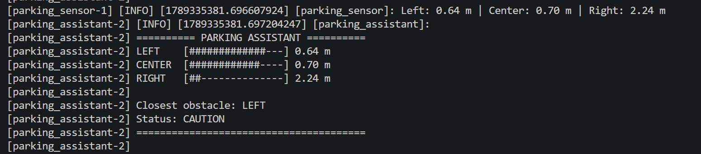

# `mol_vp3_parking` package
ROS 2 python package.  [](https://docs.ros.org/en/humble/)
## Packages and build

It is assumed that the workspace is `~/ros2_ws/`.

### Clone the packages
``` r
cd ~/ros2_ws/src
```
``` r
git clone https://github.com/balintmolnar21/mol_vp3_parking
```

### Build ROS 2 packages
``` r
cd ~/ros2_ws
```
``` r
colcon build --packages-select mol_vp3_parking --symlink-install
```

<details>
<summary> Don't forget to source before ROS commands.</summary>

``` bash
source ~/ros2_ws/install/setup.bash
```
</details>

``` r
ros2 launch mol_vp3_parking parking_assistant.launch.py
```

## Parking Assistant

A package egy ROS 2 alapú szimulált parkolási asszisztenst valósít meg Python nyelven.

A rendszer három virtuális távolságérzékelőt használ:

- LEFT
- CENTER
- RIGHT

A `/parking_sensor` node véletlenszerű távolságértékeket generál a három szenzorhoz, majd ezeket a `/parking_distances` topicban publikálja.

A `/parking_assistant` node feliratkozik a `/parking_distances` topicra, meghatározza a legközelebbi akadály irányát és távolságát, majd parkolási figyelmeztetési szintet határoz meg.

### Warning levels

| Distance | Status |
| --- | --- |
| > 1.00 m | SAFE |
| 0.61 - 1.00 m | CAUTION |
| 0.31 - 0.60 m | WARNING |
| <= 0.30 m | STOP |

## Nodes and topics

### `/parking_sensor`

Publishes:

`/parking_distances`

Message type:

`std_msgs/msg/Float32MultiArray`

Az üzenet három távolságértéket tartalmaz:

```text
[LEFT, CENTER, RIGHT]
```

### `/parking_assistant`

Subscribes:

`/parking_distances`

Publishes:

`/parking_status`

Message type:

`std_msgs/msg/String`

Példa:

```text
WARNING | Closest obstacle: CENTER | Distance: 0.43 m
```

## Run nodes separately

Parking sensor:

```bash
ros2 run mol_vp3_parking parking_sensor
```

Parking assistant:

```bash
ros2 run mol_vp3_parking parking_assistant
```

## Graph


## Terminal visualization

```text
========== PARKING ASSISTANT ==========

LEFT    [####------------] 1.91 m
CENTER  [##############--] 0.42 m
RIGHT   [########--------] 1.31 m

Closest obstacle: CENTER
Status: WARNING

=======================================
```

## Runtime screenshots

### Parking assistant



### ROS 2 graph

